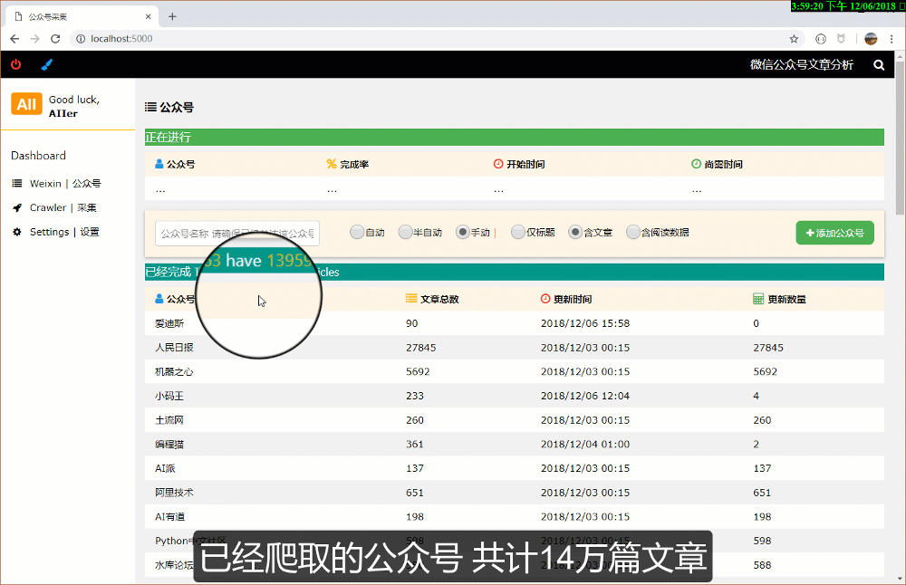
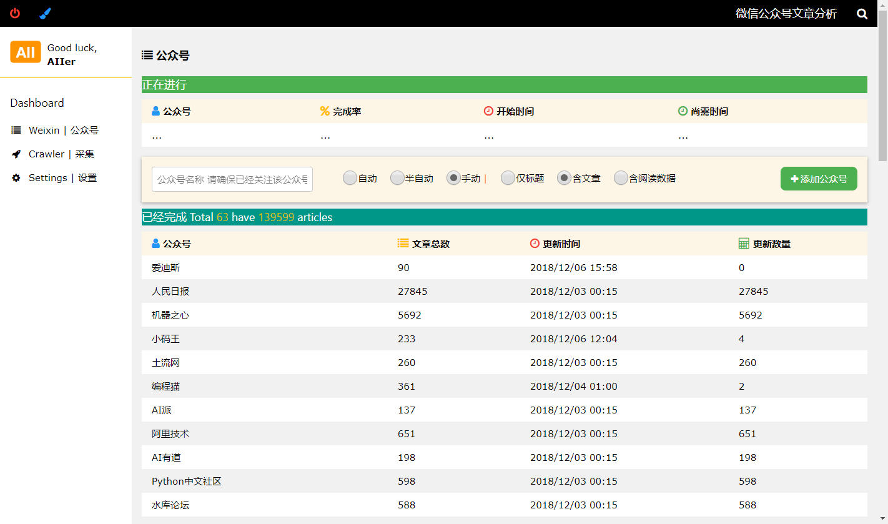
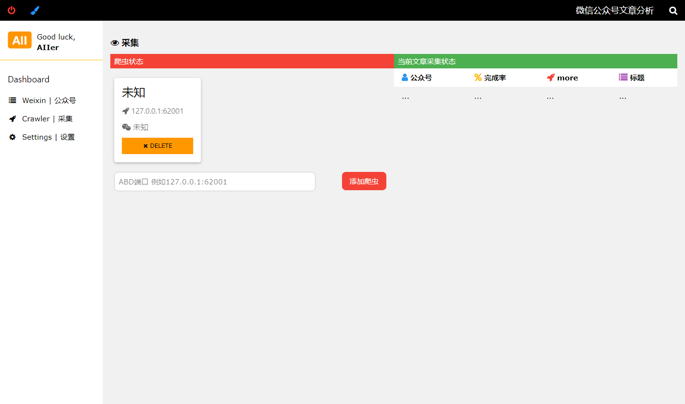
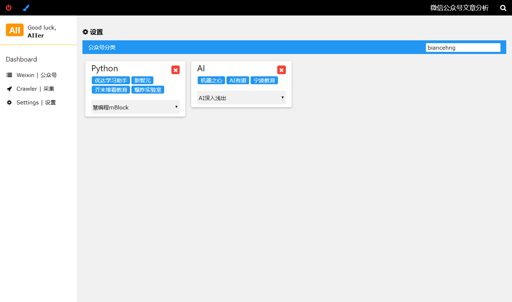
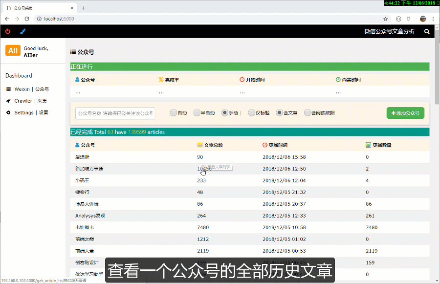
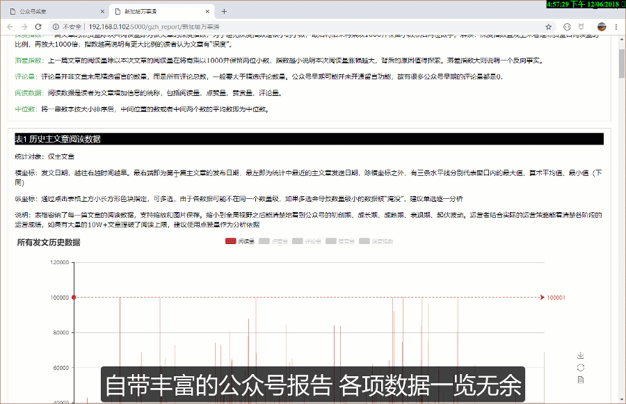
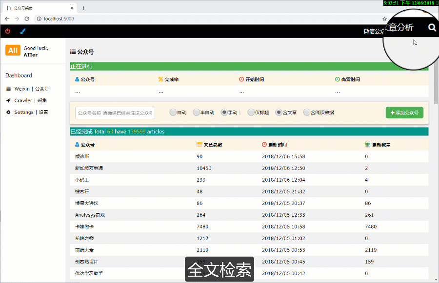

## What is weixin_crawler?

weixin_crawler是一款使用Scrapy、Flask、Echarts、Elasticsearch等实现的微信公众号文章爬虫，自带分析报告和全文检索功能，几百万的文档都能瞬间搜索。weixin_crawler设计的初衷是尽可能多、尽可能快地爬取微信公众的历史发文

如果你想先看看这个项目是否有趣，这段不足3分钟的介绍视频一定是你需要的：

https://www.youtube.com/watch?v=CbfLRCV7oeU&t=8s

## 主要特点

1. 使用Python3编写

2. 爬虫框架为Scrapy并且实际用到了Scrapy的诸多特性，是深入学习Scrapy的不错开源项目

3. 利用Flask、Flask-socketio、Vue实现了高可用性的UI界面。功能强大实用，是新媒体运营等岗位不错的数据助手

4. 得益于Scrapy、MongoDB、Elasticsearch的使用，数据爬取、存储、索引均简单高效

5. 支持微信公众号的全部历史发文爬取

6. 支持微信公众号文章的阅读量、点赞量、赞赏量、评论量等数据的爬取

7. 自带面向单个公众号的数据分析报告

8. 利用Elasticsearch实现了全文检索，支持多种搜索和模式和排序模式，针对搜索结果提供了趋势分析图表

9. 支持对公众号进行分组，可利用分组数据限定搜索范围

10. 原创手机自动化操作方法，可实现爬虫无人监管

11. 反爬措施简单粗暴

## 使用到的主要工具

| 语言  |         | Python3.6                                     |
| --- | ------- | --------------------------------------------- |
| 前端  | web框架   | Flask / Flask-socketio / gevent               |
|     | js/css库 | Vue / Jquery / W3css / Echarts / Front-awsome |
| 后端  | 爬虫      | Scrapy                                        |
|     | 存储      | Mongodb / Redis                               |
|     | 索引      | Elasticsearch                                 |

## 运行方法

> #### Insatall  mongodb / redis / elasticsearch and run them in the background
> 
> 1. downlaod mongodb / redis / elasticsearch from their official sites and install them
> 
> 2. run them at the same time under the default configuration. In this case mongodb is localhost:27017 redis is localhost:6379(or you have to config in weixin_crawler/project/configs/auth.py)
> 
> #### Install proxy server and run proxy.js
> 
> 1. install nodejs and then npm install anyproxy and redis in weixin_crawler/proxy
> 
> 2. cd to weixin_crawler/proxy and run node proxy.js
> 
> 3. install anyproxy https CA in both computer and phone side
> 
> 4. if you are not sure how to use anyproxy, [here ](https://github.com/alibaba/anyproxy)is the doc
> 
> #### Install the needed python packages
> 
> 1. NOTE: you may can not simply type pip install -r requirements.txt to install every package, twist is one of them which is needed by scrapy
> 
> 2. I am not sure if your python enviroment will throw other package not found error, just install any package that is needed
> 
> #### Some source code have to be modified(maybe it is not reasonable)
> 
> 1. scrapy Python36\Lib\site-packages\scrapy\http\request\ \__init\__.py  --> weixin_crawler\source_code\request\\__init\__.py
> 
> 2. scrapy Python36\Lib\site-packages\scrapy\http\response\ \__init\__.py --> weixin_crawler\source_code\response\\\__init\__.py
> 
> 3. pyecharts Python36\Lib\site-packages\pyecharts\base.py --> weixin_crawler\source_code\base.py. In the case function get_echarts_options is added in line 106
> 
> #### If you want weixin_crawler work automatically those steps are necessary or you shoud operate the phone to get the request data that will be detected by Anyproxy manual
> 
> 1. Install abd and add it to your path(windows for example)
> 
> 2. install android emulator(NOX suggested) or plugin your phone and make sure you can operate them with abd from command line tools
> 
> 3. If mutiple phone are connected to your computer you have to find out their adb ports which will be used to add crawler
> 
> #### Run the main.py
> 
> Just run python weixin_crawler\project\main.py. Now open the browser and everything you want would be in localhost:5000.
> 
> In this long step list you may get stucked, join our community for help, tell us what you have done and what kind of error you have found.
> 
> Let's go to explore the world in localhost:5000 together

## UI界面

UI主界面

添加公众号爬取任务和已经破去的公众号列表

爬虫界面

设置界面

公众号历史文章列表

报告

搜索

## 加入社区

不管你是一个技术小白
